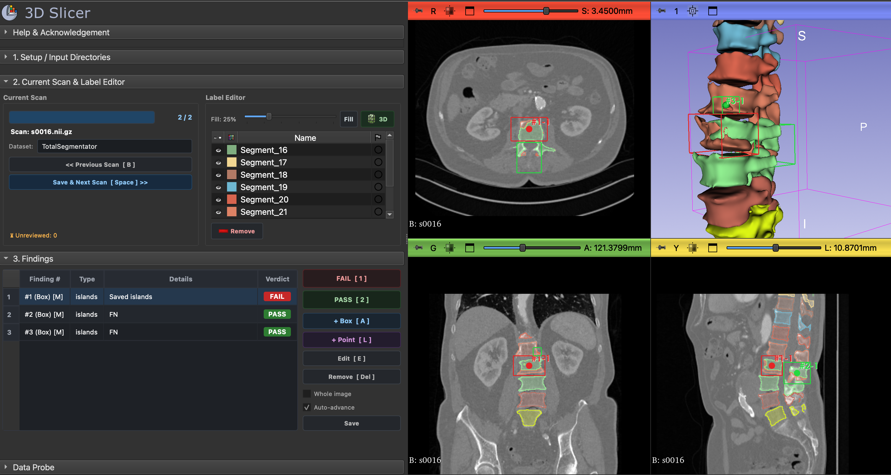

# Segmentation Reviewer - 3D Slicer Module

A modular 3D Slicer Scripted Loadable Module for visual auditing, quality control, and comparison of medical image segmentations (Deep Learning predictions and Ground Truth masks) and manual error detections.

> This extension was done because I needed to review tons of image-segmentation pairs. It was done at first with QTDesigner, modified the code by hand and scaled and refactored with generative AI, so some things might be a little flimsy. I revised all of the files and divided everything into their own atomic methods and scripts but some things are very out of my knowledge about 3D Slicer scripting and UI design.



---

## 1. Project Architecture

The module is organized into separated UI components and method controllers:

```
SegmentationReviewer/
├── SegmentationReviewer.py       # Thin Slicer entry point (< 60 lines)
├── README.md                     # Documentation & user manual
└── SegmentationReviewerLib/      # Implementation package
    ├── __init__.py               # Re-exports Logic and Widget
    ├── logic.py                  # Core scene & data logic, dual segmentation management
    ├── markups.py                # ROI/Landmark coordinate transforms (IJK <-> RAS)
    ├── storage.py                # QC JSON parsing and evaluation saving
    ├── styles.py                 # Dark theme design system & verdict badges
    ├── methods/                  # Modular business logic per box
    │   ├── __init__.py
    │   ├── setup_box.py          # Queue building, path validation, load queue
    │   ├── current_scan_box.py   # Scan navigation, dataset metadata, progress, auto-save
    │   ├── label_editor_box.py   # Opacity slider, 3D surface, Preds vs GT switching
    │   └── findings_box.py       # Table events, scoring, manual box/point placement, undo
    └── ui/                       # Declarative UI boxes
        ├── __init__.py
        ├── setup_box.py          # Section 1: Predictions, GT, Volume, QC, Output
        ├── current_scan_box.py   # Section 2 Left: Progress, Scan ID, Prev/Next
        ├── label_editor_box.py   # Section 2 Right: Active Seg switcher, 3D, Segments table
        ├── findings_box.py       # Section 3: 75% Table / 25% Action Buttons
        └── main_widget.py        # Widget orchestrator composing UI blocks & shortcuts
```

---

## 2. Key Features

### Dual Segmentation Review (DL Predictions vs. Ground Truth)
- **Separate Directory Pickers**: Select deep learning model predictions (`Predictions *`) and reference masks (`Ground Truth`) side-by-side.
- **Active Segmentation Switcher**: Easily toggle the active segmentation node in the label editor between Predictions and Ground Truth.
- **GT Overlay**: One-click button to toggle 2D/3D visibility of Ground Truth reference masks as a faint overlay to directly compare against DL predictions.

### Modular Box-Per-File Architecture
- **Isolated Logic**: All UI event handling and coordinate math are separated into `methods/` scripts per box.
- **Clean Widget Orchestration**: `ui/main_widget.py` simply composes the blocks into the layout without bloated monolithic methods.

### Quality Control Scoring
- **`FAIL` (0)**: Stored as `0` in output JSON. Displayed as a solid red badge.
- **`PASS` (1)**: Stored as `1` in output JSON. Displayed as a solid green badge.
- **Whole-Scan Evaluation**: Review segmentations that have no pre-computed bounding boxes or evaluate entire volumes at once.

---

## 3. Keyboard Shortcuts

| Shortcut | Action | Description |
| :--- | :--- | :--- |
| **`1`** or **`F`** | **Mark FAIL** | Flags finding or scan as FAIL (`eval: 0`). |
| **`2`** or **`P`** | **Mark PASS** | Flags finding or scan as PASS (`eval: 1`). |
| **`A`** | **Add Missed Box** | Activates drawing mode to place a manual 3D ROI. |
| **`L`** | **Add Landmark** | Activates placement mode to place a point landmark. |
| **`E`** | **Edit Finding** | Enables interactive handles on the selected finding. |
| **`Del`** / **`Backspace`** | **Remove Finding** | Deletes finding from current scan and table. |
| **`Ctrl + Z`** / **`Cmd + Z`** | **Undo Delete** | Restores the last removed finding and ROI. |
| **`Space`** or **`N`** | **Save & Next** | Saves evaluations and advances to next scan. |
| **`B`** | **Previous Scan** | Saves evaluations and navigates to previous scan. |
